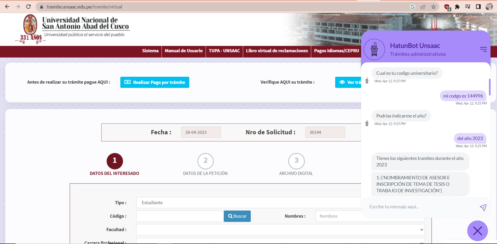

# OPTIMIZACIÓN DE LA ASISTENCIA VIRTUAL EN EL TRÁMITE DOCUMENTARIO DE LA UNIVERSIDAD NACIONAL DE SAN ANTONIO ABAD DEL CUSCO MEDIANTE LA IMPLEMENTACIÓN DE UN CHATBOT BASADO EN INTELIGENCIA ARTIFICIAL
Este chatbot está siendo desarrollado por Eber Chavez y Cristian Becerra como parte de la tesis de la UNSAAC Universidad Nacional de San Antonio Abad del Cusco. Python, RASA, React JS, API



## PreGrado 2022-2023

### Autores: Eber Chavez y Cristian Becerra 

## Descripción
En este repositorio se puede consultar todo el código desarrollado en Rasa expuesto a lo largo del trabajo de investigación. 

<a href="https://rasa.com/"></a> 

## Instalación


En primer lugar, hay que instalar [Visual C++ Build Tools](https://visualstudio.microsoft.com/es/visual-cpp-build-tools/). Además, se tienen que marcar las casillas que aparecen en la imagen. Una vez instalado, hay que instalar la versión de Rasa mencionada anteriormente utilizando la siguiente línea de comando

```bash
pip install rasa==3.0
```

A la hora de instalar Rasa se instala una versión del paquete `rasa-sdk`, librería que proporciona las herramientas necesarias para escribir acciones personalizadas en python, que no es compatible con Rasa. Lo mismo ocurre con la librería `tensorflow-addons`. Esto se soluciona fácilmente desinstalando dichos paquetes e instalando la versiones deseadas.

```bash
pip uninstall rasa-sdk tensorflow-addons
pip install rasa-sdk==1.9.0 tensorflow-addons==0.9.1
```

Otros paquetes adicionales que se han utilizado y necesitan ser instalados son los siguientes

```bash
conda install flask pandas seaborn pathlib
```

También se ha adjuntado el modelo ya entrenado que se puede encontrar en la carpeta `/models`. Para hacer uso del bot hay que correr las siguientes líneas de comando en diferentes terminales.


```bash
#Iniciar el servidor de las acciones
rasa run actions --actions actions
```

Para comenzar a hablar con el bot se puede hacer o bien desde la terminal mediante el comando

```bash
rasa shell --endpoints endpoints.yml
```

o utilizando el widget integrado en el frontend.
